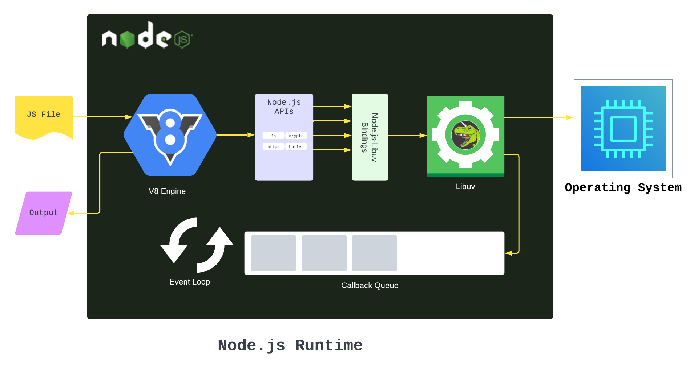
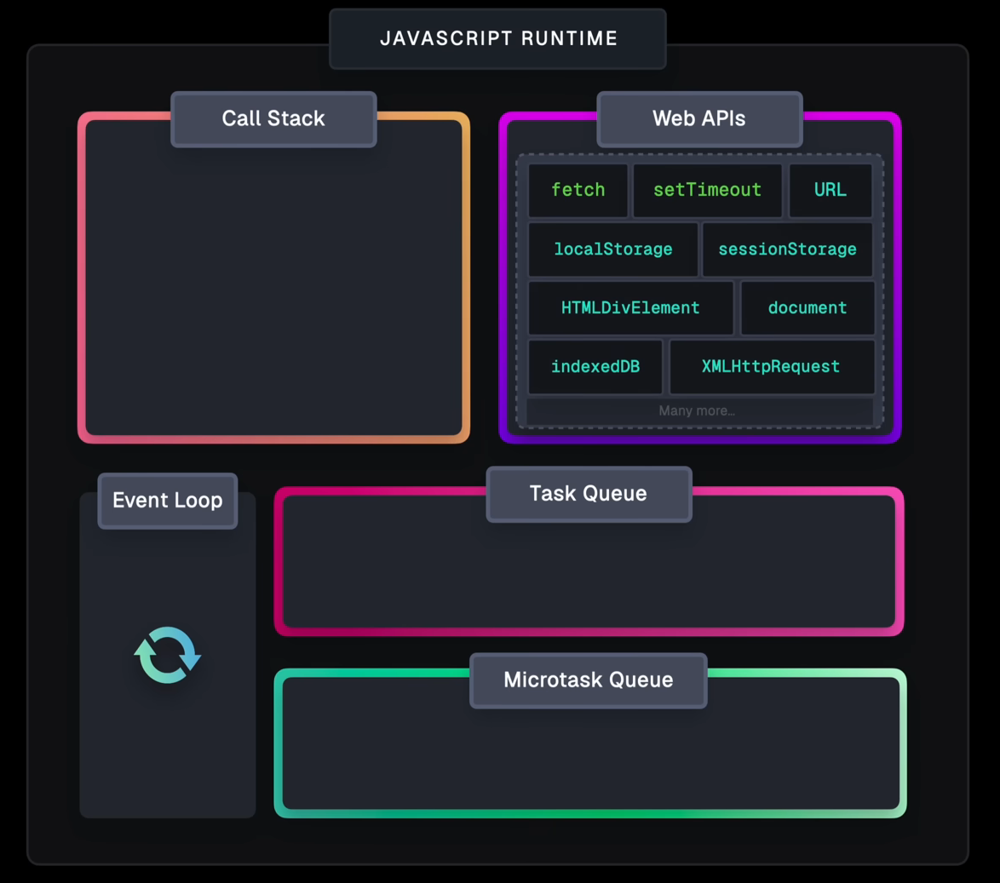

# Node.js
Node.js is an asynchronous event driven JavaScript runtime built on Chrome's V8 JavaScript engine. It allows developers to run JavaScript on the server side, enabling the creation of scalable and high-performance applications. It uses an event-driven, non-blocking I/O model that makes it lightweight and efficient.




# How does it work?
Node.js uses a single-threaded event loop architecture to handle multiple connections concurrently. This means that it can handle many requests at the same time without blocking the execution of other code. The event loop is responsible for managing asynchronous operations to avoid blocking the main thread, allowing Node.js to perform non-blocking I/O operations.

## V8 Engine
- The V8 engine is an open-source JavaScript engine developed by Google for Chrome and Node.js.
- It compiles JavaScript code into machine code using Just-In-Time (JIT) compilation, which improves performance by executing code directly on the CPU.
- The V8 engine contains a memory heap and call stack. 
- The memory heap is used for dynamic memory allocation, while the call stack is used for function execution and management.
- Memory heap - Whenever we create a variable that holds an object or function in JavaScript, the engine saves that value in the memory heap. 
- Call stack -  It is a data structure that manages the order of functions to be executed. Whenever the program invokes a function, the function is placed on the call stack and can only leave the stack when the engine has handled that function.

## Libuv
- Libuv is a multi-platform support library with a focus on asynchronous I/O.
- It provides the event loop, thread pool, and other features that enable Node.js to perform non-blocking I/O operations.
- I/O operations send requests to the operating system, which handles them in the background. Include reading & writing files, network requests, and database queries.

## Event Loop
### Call Stack

- A **LIFO** (Last In, First Out) stack.
- Holds the currently executing functions.
- When a function is called, it's **pushed** onto the stack.
- When it returns, it's **popped** off.

```js
function sayHi() {
  console.log('Hi');
}
sayHi(); // pushed -> executed -> popped
```
### Web APIs
- Provided by the browser (or Node.js runtime) to handle asynchronous tasks not part of the JavaScript engine.
- Handles asynchronous tasks like: `setTimeout`, `DOM events`, `HTTP requests`, `File I/O`. 
```js
setTimeout(() => {
  console.log('Timeout!');
}, 1000); // pushed -> executed after 1s -> popped
```

### Task Queue
- Once Web API finishes, it pushes the callback to the **Task Queue**.
- The event loop checks the call stack and if it's empty, it pushes the callback from the Task Queue to the call stack for execution.

### Microtask Queue
- A special queue for promises and `MutationObserver` callbacks.
- Microtasks are executed before the next task from the Task Queue.
```js
Promise.resolve().then(() => console.log('Microtask'));
setTimeout(() => console.log('Macrotask'), 0);

// Output:
// Microtask
// Macrotask
```
### Event Loop
- The event loop is the mechanism that continuously checks the call stack and the task queues.
- It ensures that the call stack is empty before executing the next task from the Task Queue or Microtask Queue.
- It allows JavaScript to perform non-blocking I/O operations, making it suitable for building scalable applications.

Call Stack -> Web APIs -> Task Queue -> Event Loop -> Call Stack
- The event loop is responsible for managing the execution of asynchronous code in JavaScript.

--- 

`node .\filename.js` - Runs a JavaScript file named **filename.js** in Node.js.  

# REPL
- REPL stands for Read-Eval-Print Loop.
- It is an interactive programming environment that allows developers to execute JavaScript code line by line.
- The REPL reads the input code, evaluates it, prints the result, and then loops back to read the next line of code.
- It is useful for testing small code snippets, debugging, and exploring JavaScript features.


`node` - Starts the Node.js REPL.
`Ctrl + L` - Clears the REPL screen.
`Ctrl + C` - Exits the REPL.

`.editor` - Enters the editor mode for multi-line input.


# npm
npm (Node Package Manager) is the default package manager for Node.js. It allows developers to install, share, and manage packages (libraries or modules) that can be used in their Node.js applications. npm provides a command-line interface (CLI) for managing packages and a registry where developers can publish their own packages. 

`npm` - Shows list of available commands.
`npm init` - Initializes a new Node.js project and creates a package.json file. 
`npm init -y` - Initializes a new Node.js project with default settings and creates a package.json file.
`npm install` - Installs all packages from package-lock.json.
`npm install <package-name>` - Installs a specific package and adds it to the dependencies in package.json.

## package.json
- A JSON file that contains metadata about the project, including its name, version, description, author, license, and dependencies.
- It is created when you run `npm init` and is used to manage the project's dependencies and scripts.

```json
{
  "name": "my-node-project",
  "version": "1.0.0",
  "main": "index.js",
  "scripts": {
    "start": "node index.js",
    "dev": "nodemon index.js"
  },
  "dependencies": {},
  "devDependencies": {}
}
```

where `index.js` is the entry point of the application. The `scripts` section allows you to define custom commands that can be run using `npm run <script-name>`. For example, `npm run start` will execute the command defined in the `start` script.

## package-lock.json
- A JSON file that contains the exact version of each installed package and its dependencies.
- It is automatically generated when you run `npm install` and ensures that the same versions of packages are installed across different environments.